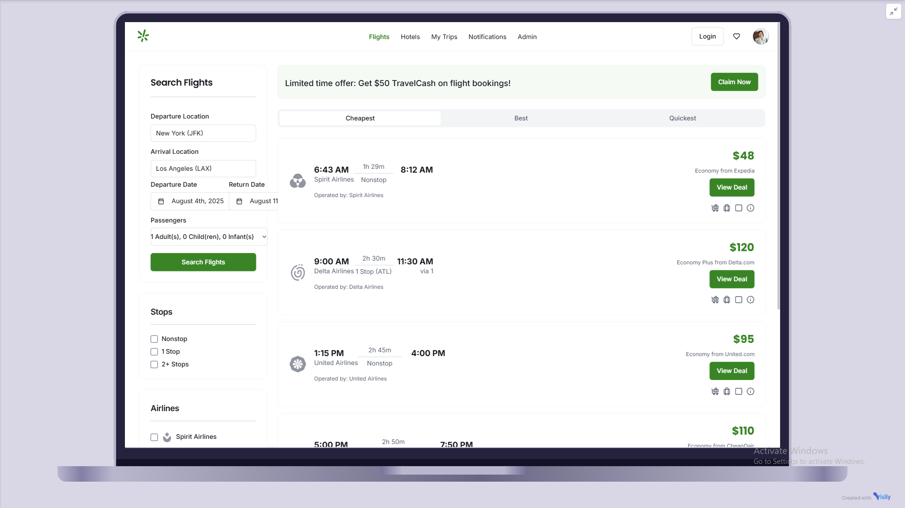
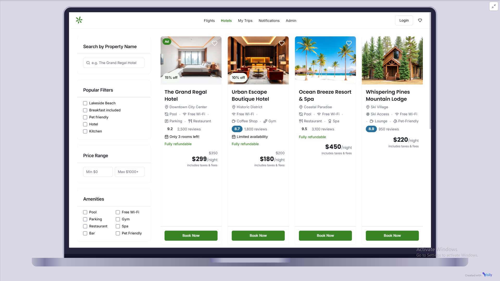
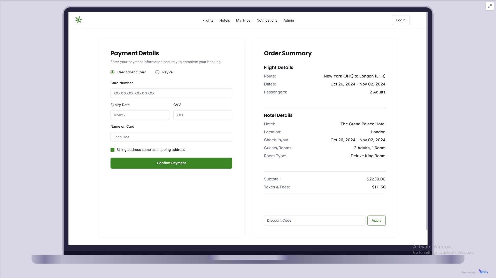
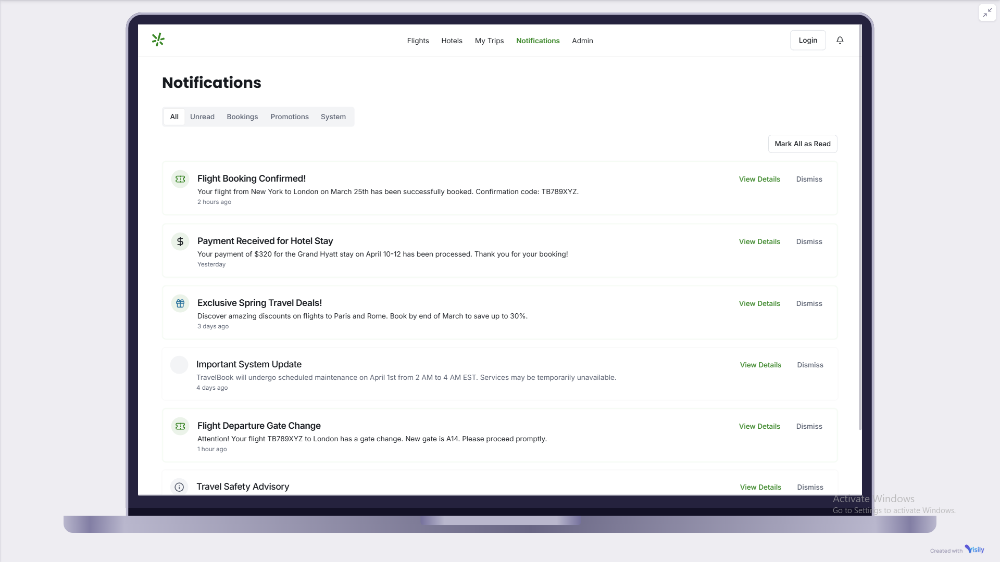
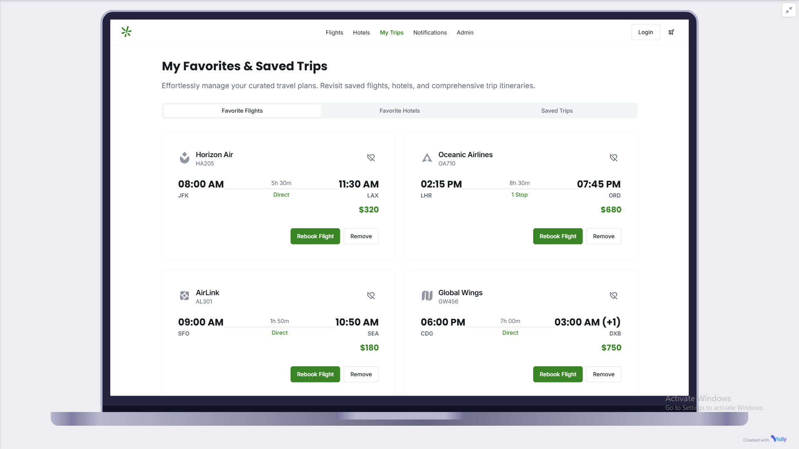
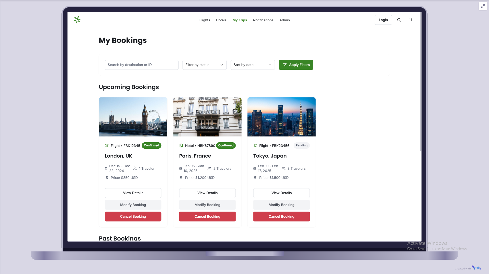
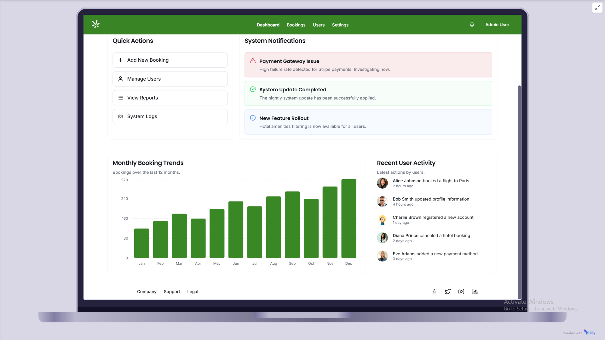

# Booking System

## Table of Contents

- [Booking System](#booking-system)
  - [Table of Contents](#table-of-contents)
  - [Key Features](#key-features)
    - [Feature 1: Flight Search \& Comparison](#feature-1-flight-search--comparison)
      - [Feature 1 Live Design Preview](#feature-1-live-design-preview)
    - [Feature 2: Hotel Browsing \& Booking](#feature-2-hotel-browsing--booking)
      - [Feature 2 Live Design Preview](#feature-2-live-design-preview)
    - [Feature 3: Payment \& Checkout](#feature-3-payment--checkout)
      - [Feature 3 Live Design Preview](#feature-3-live-design-preview)
    - [Feature 4: Notification System](#feature-4-notification-system)
      - [Feature 4 Live Design Preview](#feature-4-live-design-preview)
    - [Feature 5: Favorites \& Saved Trips](#feature-5-favorites--saved-trips)
      - [Feature 5 Live Design Preview](#feature-5-live-design-preview)
    - [Feature 6: Order History \& Booking Management](#feature-6-order-history--booking-management)
      - [Feature 6 Live Design Preview](#feature-6-live-design-preview)
    - [Feature 7: Admin Dashboard](#feature-7-admin-dashboard)
      - [Feature 7 Live Design Preview](#feature-7-live-design-preview)
  - [Database Documentation](#database-documentation)
  - [API Documentation](#api-documentation)
  - [System Requirements](#system-requirements)
  - [Getting Started](#getting-started)
  - [For Registered Users](#for-registered-users)

This booking system is a comprehensive travel platform that enables users to search, compare, and book flights, hotels, and other travel services with ease. The system provides real-time availability, secure payment processing, and personalized features for both guests and registered users.

## Key Features

### Feature 1: Flight Search & Comparison

#### Feature 1 Live Design Preview

*Fig 1.1 - Flight search interface with comparison panel*

---

**Description:**  
Enables users to search for available flights between two destinations on specific dates and compare results by price, duration, layovers, and airline.

**Key Functionalities:**

- Input departure and destination airports/cities
- Select departure and return dates (optional for one-way)
- Choose number of passengers and cabin class (Economy, Business, etc.)
- Fetch real-time flight results via third-party APIs
- Display detailed flight options (airline, price, layovers, duration, departure/arrival times)

**Filter Results By:**

- Price range
- Number of stops
- Airline
- Flight duration
- Departure/Arrival time

**Sort Results By:**

- Lowest Price
- Shortest Duration
- Fewest Layovers

**Additional Features:**

- View full itinerary and baggage policies
- Select preferred flight to continue booking

**Actors:**

- Customer (Registered or Guest)

**Preconditions:**

- Valid departure and arrival inputs
- Active internet connection

**Postconditions:**

- Display a list of available flights
- Optionally save search history (if logged in)

**Business Rules:**

- Sponsored flights may be prioritized in results
- Flights from blacklisted carriers should be excluded
- Seat availability must be revalidated before proceeding to booking

For Flow Diagram and Sequence Diagram see:  
📂 [FeatureOne.md](./FeatureOne.md)  

### Feature 2: Hotel Browsing & Booking

#### Feature 2 Live Design Preview

  
*Fig 2.1 - Hotel listing with room selection modal*

---

**Description:**  
Allows users to explore available hotels based on location, travel dates, price, and rating, and to complete bookings securely through the platform.

**Key Functionalities:**

- Search hotels by:
  - City, location, or hotel name
  - Check-in and check-out dates
  - Guest count and room count
- Filter hotel listings by:
  - Price
  - Star rating
  - User reviews
  - Amenities (Wi-Fi, Parking, Pool, etc.)
- View hotel details:
  - Photos
  - Description and amenities
  - Location on map
  - Cancellation policy
- View available room types and pricing
- Select room and proceed to payment and confirmation

**Actors:**

- Customer

**Preconditions:**

- Valid check-in/check-out dates and destination must be selected

**Postconditions:**

- Hotel room selected and stored in session/cart for checkout

**Business Rules:**

- Availability must be confirmed in real-time before booking
- Full cancellation and refund policy must be shown before payment

### Feature 3: Payment & Checkout

#### Feature 3 Live Design Preview

  
*Fig 3.1 - Multi-step checkout process with payment options*

---

**Description:**  
Handles secure and seamless checkout for flights, hotels, and rentals using multiple payment options and proper validation.

**Key Functionalities:**

- Display selected services (flight/hotel/car) summary during checkout
- Allow selection of preferred payment method:
  - Credit/Debit Card
  - Digital Wallet
  - Pay Later (if applicable)
- Apply promo codes, discounts, or loyalty rewards
- Display breakdown of pricing (taxes, fees, total)
- Process payments securely through integrated payment gateway
- Generate booking confirmation upon successful transaction
- Provide downloadable receipt and confirmation via email/SMS

**Actors:**

- Customer
- Payment Gateway Provider

**Preconditions:**

- At least one valid booking item must exist in the checkout session

**Postconditions:**

- Payment is recorded, and booking is confirmed
- Confirmation details are stored and sent to the customer

**Business Rules:**

- Failed payments should not lock inventory or booking slots
- Sensitive payment data must not be stored locally

### Feature 4: Notification System

#### Feature 4 Live Design Preview

  
*Fig 4.1 - Notification center with filter options*

---

**Description:**  
Notifies users in real-time about booking updates, deals, and critical system alerts through multiple channels.

**Key Functionalities:**

- Send notifications for:
  - Booking confirmation
  - Flight delays or hotel cancellations
  - Payment status
  - Promotional offers
- Notification channels:
  - Email
  - SMS
  - Push notifications (mobile or browser)
- Allow users to configure notification preferences (email only, push only, etc.)
- Admins can create and schedule marketing campaigns or urgent alerts

**Actors:**

- Customer
- Admin
- System Scheduler

**Preconditions:**

- Valid contact info (email/phone/push token) must be available

**Postconditions:**

- User receives timely and relevant notifications

**Business Rules:**

- Time-sensitive notifications (like gate changes) must be prioritized
- Promotional content should respect opt-in/out settings

### Feature 5: Favorites & Saved Trips

#### Feature 5 Live Design Preview

  
*Fig 5.1 - Saved items gallery with trip organizer*

---

**Description:**  
Enables users to save favorite destinations, airlines, hotels, or full trip plans for quicker access and future booking.

**Key Functionalities:**

- Mark flights, hotels, and destinations as favorites
- Save full trip plans with flights + hotel + car rental combos
- Access a personalized "Favorites" page
- Edit or remove saved items anytime
- Option to share saved trips with others via link

**Actors:**

- Customer

**Preconditions:**

- User must be logged in

**Postconditions:**

- Favorites stored in user profile for reuse or quick access

**Business Rules:**

- Favorites should sync across devices (if logged in)
- Automatically remove unavailable items after a set period

### Feature 6: Order History & Booking Management

#### Feature 6 Live Design Preview

  
*Fig 6.1 - Timeline view of bookings with filter controls*

---

**Description:**  
Provides users with access to their past and upcoming bookings, including the ability to view, modify, or cancel where applicable.

**Key Functionalities:**

- View full history of:
  - Flight bookings
  - Hotel reservations
  - Car rental orders
- Filter bookings by status (Upcoming, Past, Cancelled)
- View detailed order data: provider, amount, dates, travelers
- Cancel or request changes (based on provider policy)
- Download booking confirmations or invoices
- Rebook a previous trip with one click

**Actors:**

- Customer

**Preconditions:**

- User must be authenticated

**Postconditions:**

- Booking data displayed, editable if still within allowed window

**Business Rules:**

- Cancellations and changes are governed by each provider's policy
- Refund status must be tracked and displayed where applicable

### Feature 7: Admin Dashboard

#### Feature 7 Live Design Preview

  
*Fig 7.1 - Administrative analytics and user management*

---

**Description:**  
A centralized control panel for administrators to manage users, providers, bookings, content, and system analytics.

**Key Functionalities:**

- View key metrics: active bookings, revenue, top routes
- Manage users:
  - Block/unblock accounts
  - View booking behavior and fraud alerts
- Manage providers (airlines, hotels, car rental companies):
  - Approve or reject new listings
  - Edit content or pricing
- Access audit logs and usage analytics
- Manage promotions, referral programs, and loyalty settings
- Trigger global announcements or system-wide alerts

**Actors:**

- System Admin
- Support Agent
- Marketing Manager

**Preconditions:**

- Valid admin account and permissions

**Postconditions:**

- All admin actions logged and reflected system-wide

**Business Rules:**

- Admin actions must be permission-based
- Sensitive actions (e.g., refund approvals) require multi-level confirmation

## Database Documentation

For full database schema and relationships, see:  
📂 [DB.md](./DB.md)  

## API Documentation

For full API Documentation, see:  
📂 [API.md](./API.md)  

## System Requirements

- Modern web browser (Chrome, Firefox, Safari, Edge)
- Internet connection
- For mobile features: iOS 12+/Android 8+ (for best experience)

## Getting Started

1. Visit our website or download our mobile app
2. Search for flights or hotels using the search form
3. Select your preferred options
4. Proceed to checkout and complete payment
5. Receive confirmation and manage your booking in your account

## For Registered Users

Create an account to:

- Save favorite items and trips
- Access booking history
- Enable faster checkout
- Receive personalized deals
